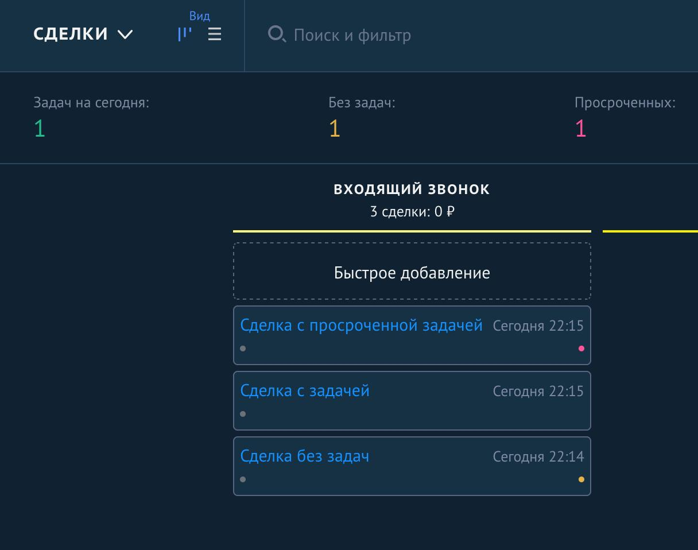

[RU](#ru) · [EN](#en)

<a id="ru"></a>

Ситуация: руководитель пишет системе «Проанализируй работу отдела продаж за последние 30 дней». Источники данных: amoCRM (сделки, задачи) и телефония (записи звонков).

Опишите архитектуру решения: какие агенты нужны, откуда и через какие API они берут данные, как обрабатываются звонки, где хранятся результаты. Достаточно схемы или одной страницы текста.


### 1. Что система делает сама, а что передаёт человеку? Назовите три главных риска или ограничения.

Система большинство задач может выполнять автоматически, за исключением случаев, когда модель не может корректно распознать диалог: сильные помехи, фрагментация записи, недостаток контекста и знаний о бизнес-домене для анализа, неправильное определение ролей. В таком сценарии карточки с такими записями могут помечаться с низким уровнем доверия либо вообще не учитываться в статистике и требовать ручного вмешательства.

Недостаточное понимание бизнес-домена. Пример: «А что мы называем конверсией?» Без точной терминологии мы можем получить неточный результат.

Неспособность модели корректно оценить бизнес-ценность конкретного сотрудника или диалога. Пример: диалог очень короткий и сделка совершена, но в дальнейшем клиент отказывается от сотрудничества. Пример 2: диалог очень длинный, без формального согласия, но затем, спустя несколько звонков, заключается контракт с последующим сотрудничеством. Такие метрики измерить довольно тяжело, учитывая объём данных и ограниченность моделей. Здесь можно работать над архитектурой и тестировать гипотезы.

### 2. Напишите фрагмент кода (Python или JS/TS, до 50 строк), который получает из amoCRM сделки без задач или с просроченными задачами. Можно вместо этого дать ссылку на свой репозиторий с похожей интеграцией.

[deals.py](deals.py)

**Вывод (id изменены):**

```python
[{'id': '00001', 'name': 'Сделка без задач', 'responsible_user_id': '00001', 'reason': 'no_task'}, {'id': '00002', 'name': 'Сделка с просроченной задачей', 'responsible_user_id': '00002', 'reason': 'overdue_task'}]
```



---

<a id="en"></a>

Scenario: a manager writes to the system, “Analyze the sales department's performance over the last 30 days.” Data sources: amoCRM (deals, tasks) and telephony (call recordings).

Describe the solution architecture: which agents are needed, where and through which APIs they obtain data, how calls are processed, and where the results are stored. A diagram or one page of text is sufficient.


### 1. What does the system do on its own, and what does it hand over to a human? Name three main risks or limitations.

The system can perform most tasks automatically, except when the model cannot correctly recognize the conversation: heavy interference, recording fragmentation, insufficient context and business-domain knowledge for analysis, or incorrect identification of roles. In this scenario, records of such calls may be marked with a low confidence level or excluded from statistics altogether and require manual intervention.

Insufficient understanding of the business domain. Example: “What do we call conversion?” Without precise terminology, we may get an inaccurate result.

The model's inability to correctly assess the business value of a particular employee or conversation. Example: the conversation is very short and the deal is closed, but the client later refuses to continue working together. Example 2: the conversation is very long, without formal agreement, but later, after several calls, a contract is signed with subsequent cooperation. Such metrics are quite difficult to measure, given the volume of data and the limitations of models. Here, we can work on the architecture and test hypotheses.

### 2. Write a code snippet (Python or JS/TS, up to 50 lines) that retrieves amoCRM deals with no tasks or overdue tasks. Alternatively, you can provide a link to your repository with a similar integration.

[deals.py](deals.py)

**Example of output:**

```python
[{'id': '00001', 'name': 'Сделка без задач', 'responsible_user_id': '00001', 'reason': 'no_task'}, {'id': '00002', 'name': 'Сделка с просроченной задачей', 'responsible_user_id': '00002', 'reason': 'overdue_task'}]
```


